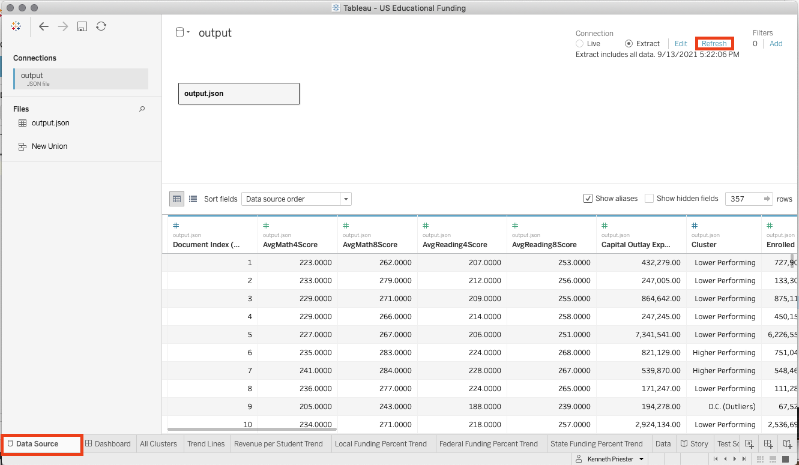

## Developer Instructions

### Setup Enviroment

Create a postgres database

Create config.py files in the database/ and Machine Learning/ directories including:
1. database username
2. database password
3. database host
4. database name
(see config_example.py)

Install python dependencies
```
pip install -r requirements.txt
```

### Populate the database with the raw data from Resources/states_all.csv

***Only required for the initial setup***

Run the following command from the root directory of the repository
```
python database/populate_database.py
```

#### Calculate useful metrics

Run the following command from the root directory of the repository
```
python database/ETL.py
```

### Determine Clusters

Run the following command from the root directory of the repository
```
python python Machine\ Learning/kmeans.py
```

### Update Dashboard

1. Open the US Educational Funding.twbx file from the presentation directory.
2. Refresh the data

